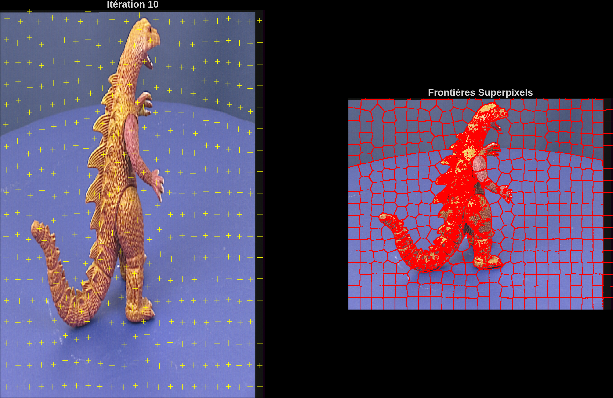
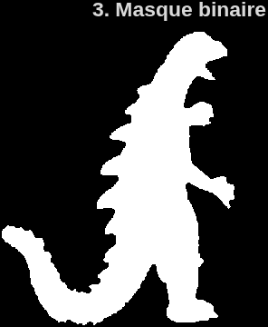
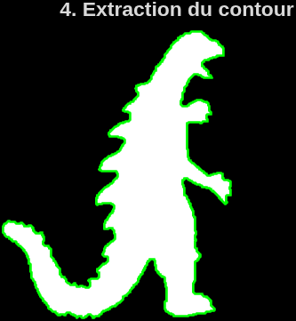
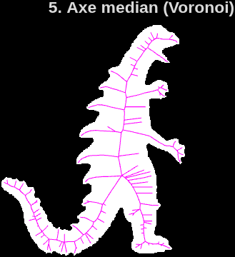
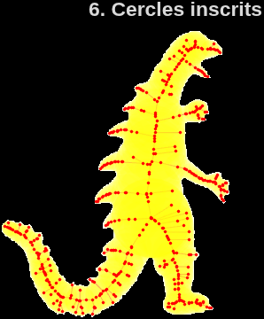
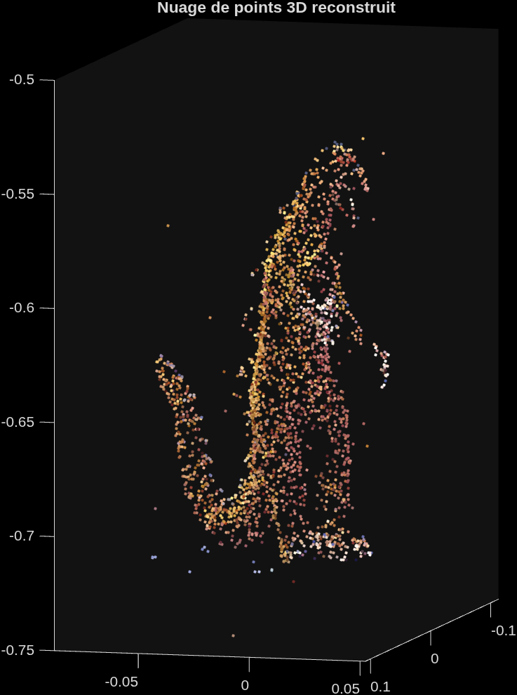
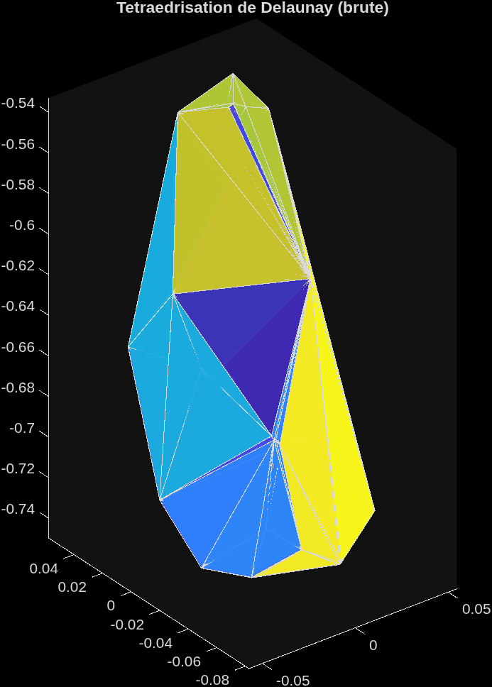
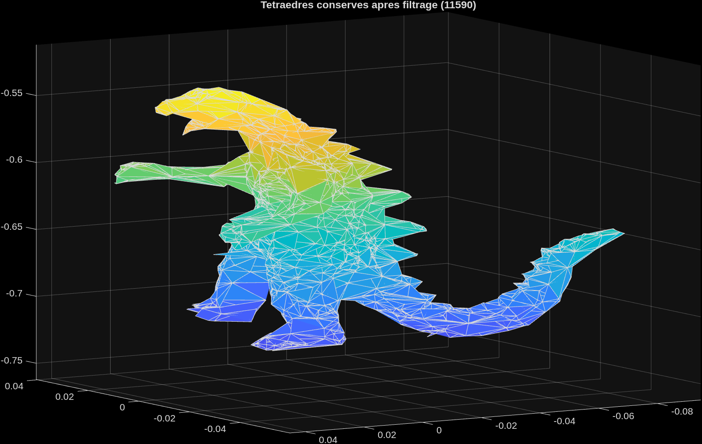
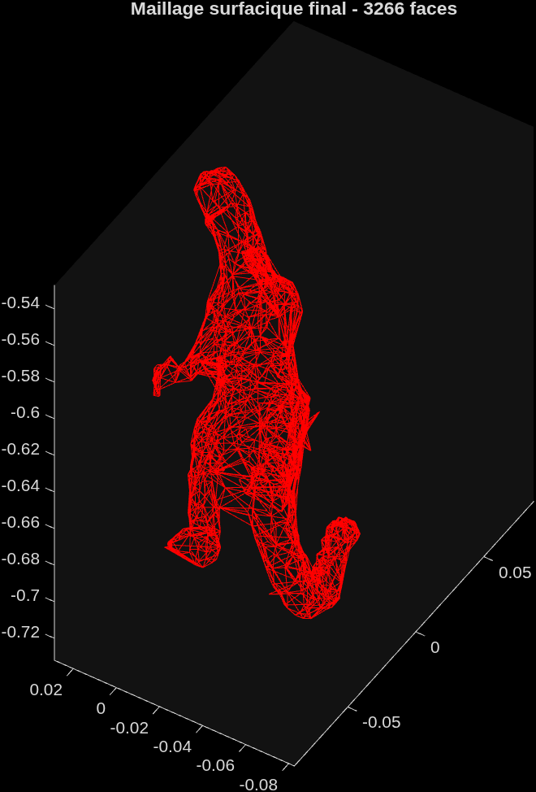
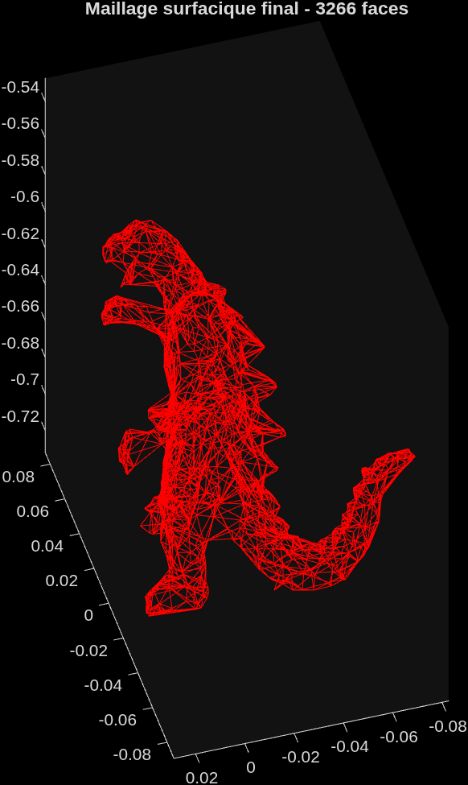

# Reconstruction 3D par silhouettes multi-vues

### Segmentation SLIC · Axe médian (Voronoï) · Enveloppe visuelle · Maillage tétraédrique

Reconstruction du maillage 3D d'une figurine à partir de **36 photographies calibrées**
prises tout autour de l'objet. Le pipeline combine segmentation d'image, analyse de forme
2D et vision multi-vues pour produire un maillage surfacique, en implémentant le principe
classique de l'**enveloppe visuelle** (*visual hull*).

📄 **[Rapport complet (PDF)](<Reconstruction 3D par silhouettes multi-vues.pdf>)** —
équations, justification des choix d'implémentation, tableaux de paramètres.

---

## Partie I — Segmentation et masques

Chaque vue est sur-segmentée en superpixels par l'algorithme **SLIC** dans l'espace
colorimétrique **LAB** (germes initialisés sur une grille, convergence en ~10 itérations),
puis chaque superpixel est classé *objet* ou *fond* selon ses composantes chromatiques (le
fond est un bleu saturé). Un nettoyage morphologique (plus grande composante connexe,
fermeture, remplissage des trous) donne un masque binaire propre pour chacune des 36 vues.

| Itération 1 (grille initiale) | Itération 10 (convergée) |
|:---:|:---:|
|  |  |

| Masque binaire | Contour extrait |
|:---:|:---:|
|  |  |

- [`src/calcul_superpixels_slic.m`](src/calcul_superpixels_slic.m) — segmentation SLIC
- [`src/binariser_dino_lab.m`](src/binariser_dino_lab.m) — binarisation + post-traitement

## Partie II — Analyse de forme : axe médian

Sur quelques images témoins, le contour de la silhouette est extrait puis son **axe
médian** est approximé par les sommets internes du diagramme de **Voronoï** des points de
contour, avec le rayon du cercle inscrit associé à chaque point du squelette.

| Axe médian (Voronoï) | Cercles inscrits |
|:---:|:---:|
|  |  |

- [`src/calcul_squelette_voronoi.m`](src/calcul_squelette_voronoi.m) — contour, Voronoï, squelette

## Partie III — Reconstruction 3D complète

À partir des correspondances multi-vues déjà appariées (`viff.xy`) et des matrices de
projection calibrées (`dino_Ps`), un nuage de points 3D coloré est reconstruit par
**triangulation linéaire (SVD/DLT)**. Ce nuage est tétraédrisé par **triangulation de
Delaunay**, puis filtré selon le principe de l'**enveloppe visuelle** : un tétraèdre n'est
conservé que si ses 5 barycentres se projettent dans au moins 30 des 36 silhouettes
binaires. Un second filtrage par volume élimine les tétraèdres résiduels trop grands. Le
maillage surfacique final est extrait par **parité des faces** (une face de surface
n'appartient qu'à un seul tétraèdre conservé).

**Nuage de points 3D reconstruit** (triangulation SVD)



**Tétraédrisation de Delaunay (brute)** → **Tétraèdres conservés après filtrage par silhouette**

| Delaunay brut | Après filtrage (enveloppe visuelle) |
|:---:|:---:|
|  |  |

**Maillage surfacique final** (extraction par parité des faces, deux points de vue)

| Vue 1 | Vue 2 |
|:---:|:---:|
|  |  |

- [`src/reconstruire_points3D.m`](src/reconstruire_points3D.m) — triangulation SVD
- [`src/calculer_barycentres_tetraedres.m`](src/calculer_barycentres_tetraedres.m) — échantillonnage barycentrique
- [`src/filtrer_tetraedres_silhouette.m`](src/filtrer_tetraedres_silhouette.m) — filtrage enveloppe visuelle
- [`src/filtrer_tetraedres_volume.m`](src/filtrer_tetraedres_volume.m) — filtrage par volume
- [`src/extraire_maillage_surfacique.m`](src/extraire_maillage_surfacique.m) — extraction du maillage

---

## Structure du dépôt

```
reconstruction-3d-silhouettes/
├── Reconstruction 3D par silhouettes multi-vues.pdf   # rapport détaillé
├── results/                               # figures générées par Process.m
└── src/
    ├── Process.m                          # script principal (orchestre les 3 parties)
    ├── calcul_superpixels_slic.m           # Partie I
    ├── binariser_dino_lab.m                # Partie I
    ├── calcul_squelette_voronoi.m          # Partie II
    ├── reconstruire_points3D.m             # Partie III
    ├── calculer_barycentres_tetraedres.m   # Partie III
    ├── filtrer_tetraedres_silhouette.m     # Partie III
    ├── filtrer_tetraedres_volume.m         # Partie III
    ├── extraire_maillage_surfacique.m      # Partie III
    ├── viff.xy                             # correspondances multi-vues fournies
    ├── dino_Ps.mat                         # matrices de projection des 36 caméras
    └── images/                             # 36 vues calibrées (viff.000 à viff.035.ppm)
```

## Prérequis et exécution

- MATLAB (Image Processing Toolbox recommandée).
- Se placer dans le dossier `src/` (les chemins vers `images/`, `viff.xy` et `dino_Ps.mat`
  sont relatifs à ce dossier).
- Exécuter `Process.m`. Les figures 3D (nuage de points, tétraédrisation, maillage final)
  sont interactives : clic-glisser pour tourner la vue.

## Points clés d'implémentation

- Les correspondances multi-vues (`viff.xy`) sont **fournies en entrée** — le matching de
  points entre les 36 images n'est pas recalculé ici ; le pipeline part de ces
  correspondances pour trianguler les points 3D.
- Le filtrage par silhouette échantillonne chaque tétraèdre en **5 barycentres** (et non
  son seul centre de gravité) pour réduire le risque de conserver un tétraèdre allongé
  partiellement hors de l'objet.
- Convention MATLAB `masque(ligne, colonne)` à respecter scrupuleusement lors de la
  projection des barycentres dans les masques — une inversion ligne/colonne fait chuter le
  nombre de tétraèdres conservés d'un facteur ~40 (détail documenté dans le rapport).
- Sur ce jeu de données, le filtrage par enveloppe visuelle réduit la tétraédrisation de
  Delaunay initiale à **11 590 tétraèdres**, puis le maillage final compte **3 266 faces**.

## Auteur

**NASMANE Abdelhak** — Master Image et Multimédia, Toulouse INP N7.
